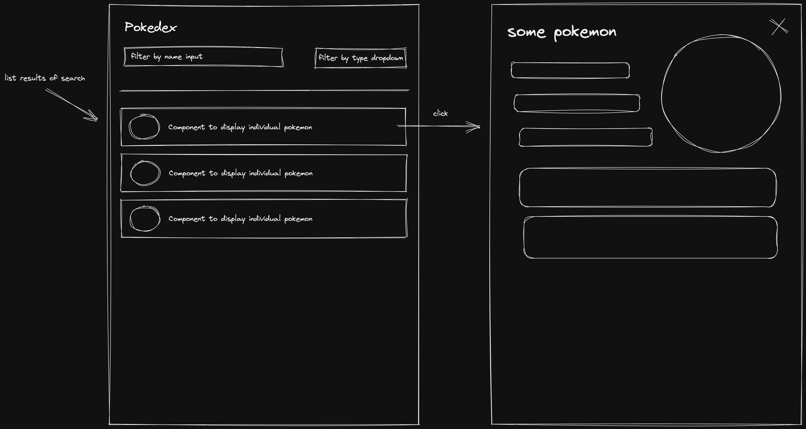

# Nuant FE Test

This project uses vite react-ts template which provides a minimal setup to get React working in Vite with ESLint rules.

It's been configured with Tailwindcss in case you want to use it Pokenode to retrieve the data of Pokemons

- [Pokenode](https://pokenode-ts.vercel.app/) (hint for the pokenode usage https://pokenode-ts.vercel.app/clients/pokemon-client) 
- [Tailwind](https://tailwindcss.com/)

The purpose of the test is to implement an app that have the ability of :

- Search for Pokemon by `name` and the posibility to filter the results by `type`
  (User can search by name, user can filter pokemons by type, user can do both at the same time also)
- Display the search results with enough detail to be able to identify to which Pokemon each result belongs.(Name and a image would do)
- View more information about the Pokemon on a dedicated page by clicking a search result. (You can display Name, different sprites, weight, height and basic information, dealing with linked entities will be bonus point but arent really mandatory).
- See the previous search results when navigating back to the search page from the pokemon details page.

So basically something like:

Feel free to take any liberties with the design, and to use any library or tool you feel will help you accomplish the task.

 ### Submitting

  To submit your finished project, share with us a link to a GitHub repository containing its code. Along with instructions on how to run the app, include answers to the following:

- What part of building the project was the most difficult? Why?
- If you had to filter the list of Pokemons by its  `type` how would you have implemented it?

Fun fact:
  - pokemon api was down when I was working on the app
  - I treated the situation as a real life situation: "Backend is not ready"
  - I worked with mocks, building the whole app using just the types found inside the api

I would say that the hardest part of implementing the app was the unclear requirements
  - in my opinion, too much is left for interpretation. Some people like this, some don't
  - but in a production ready project requirements need to be clear
  - I find the pokemon api to be too granular, to be able to complete the requirements in an quick way
    - getPokemonByName does not support partial match - making search and filter useless
    - listPokemons only returns name and url - making it hard to display an image of each pokemon
